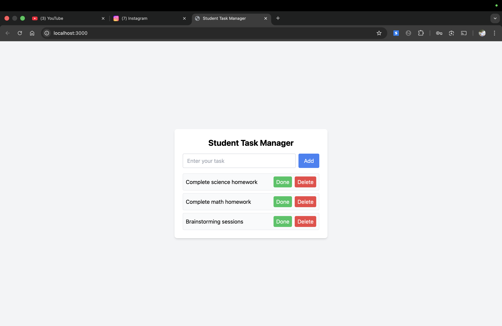
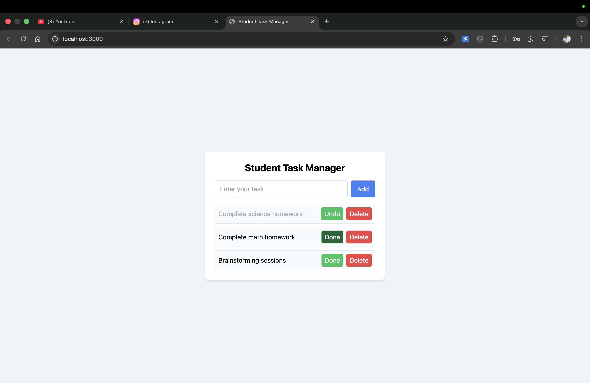
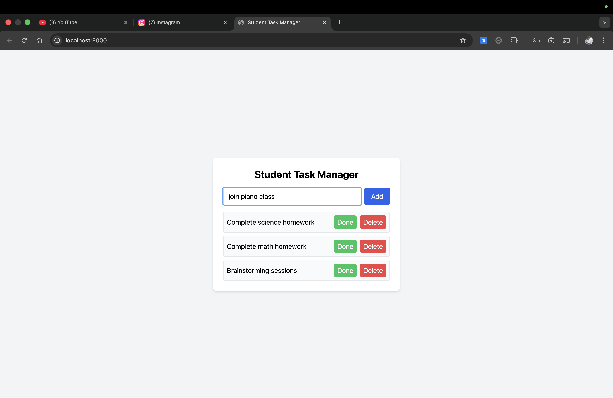

📘 Student Task Manager

A simple full-stack web application that allows students to add, view, complete, and delete homework tasks using a local backend API.

⚙️ Setup Instructions
Prerequisites

Node.js (v16+ recommended)

Backend Setup
cd backend
npm install
npm start

The server will start at:

http://localhost:3000

Frontend Setup

The frontend is served directly by the backend.

Open your browser and visit:

http://localhost:3000

## 📸 Output Screenshots

### Student Task Manager Web App

No additional setup is required.

🧠 The Logic (How I Thought)

I chose Node.js with Express for the backend because it allows quick creation of lightweight APIs that run completely locally, which aligns with the challenge constraints.

For storage, I used a local JSON file instead of a database to keep the setup simple and dependency-free while still providing data persistence across server restarts.

The frontend is built using HTML, Tailwind CSS (via CDN), and vanilla JavaScript.
Tasks are added, updated, and deleted using the fetch API so the page updates dynamically without refreshing, creating a simple Single Page Application (SPA) experience.

To avoid browser security issues when calling the API, the frontend is served as static files using Express.

Hardest Bug I Faced

I encountered a SyntaxError: Unexpected end of JSON input when reading the tasks file for the first time.
This happened because the JSON file was empty, which caused JSON.parse to fail.

I fixed this by adding a guard check to safely handle empty or missing JSON files and return an empty task list instead, preventing runtime crashes on initial execution.

📸 Output Screenshots
Student Task Manager Web App

Screenshot showing:

Multiple tasks added

One task marked as completed (strikethrough)

Delete and Done/Undo buttons visible

(Screenshot is embedded as required, not linked)

🚀 Future Improvements

If I had two more days, I would:

Add task categories or priorities

Add timestamps for tasks

Improve UI feedback (success/error messages)

Replace JSON storage with SQLite for better scalability

✅ Features Implemented

Add new tasks

View all tasks

Mark tasks as completed / undo

Delete tasks

Persistent local storage using JSON

Responsive UI using Tailwind CSS

No page refresh (AJAX-based updates)

📂 Tech Stack

Frontend: HTML, Tailwind CSS, JavaScript

Backend: Node.js, Express

Storage: Local JSON file

🏁 Final Notes

This project runs fully offline, requires minimal setup, and demonstrates core full-stack concepts such as API design, frontend-backend communication, state management, and persistence.